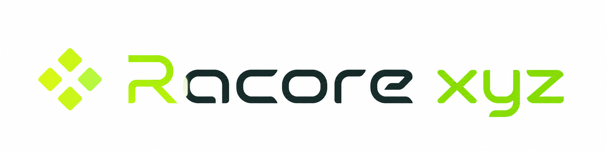
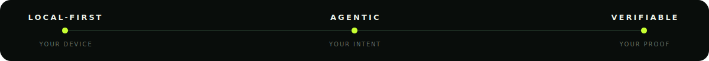
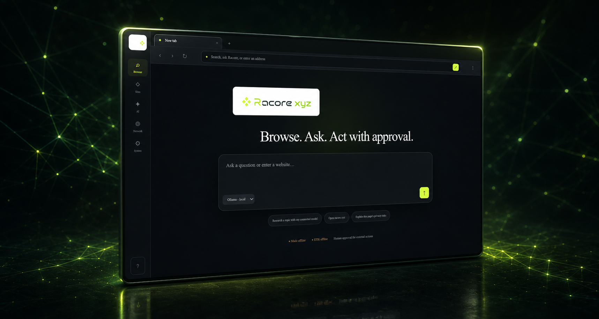
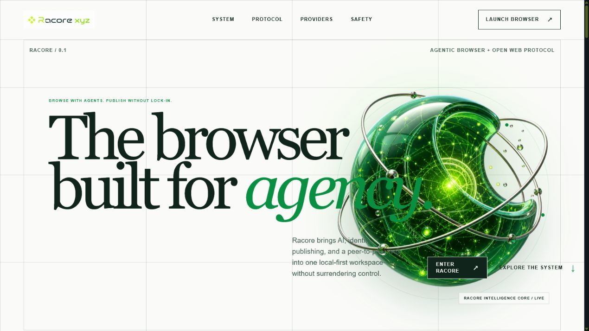
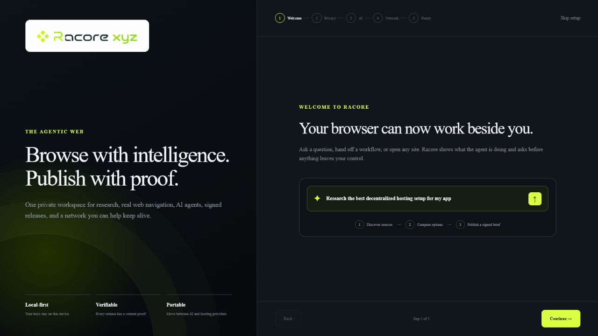
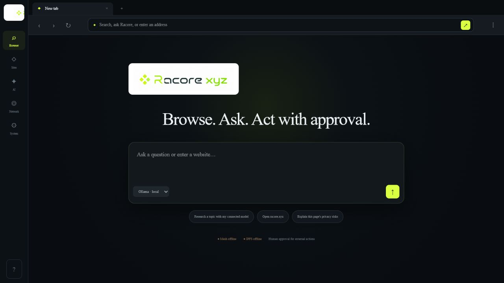
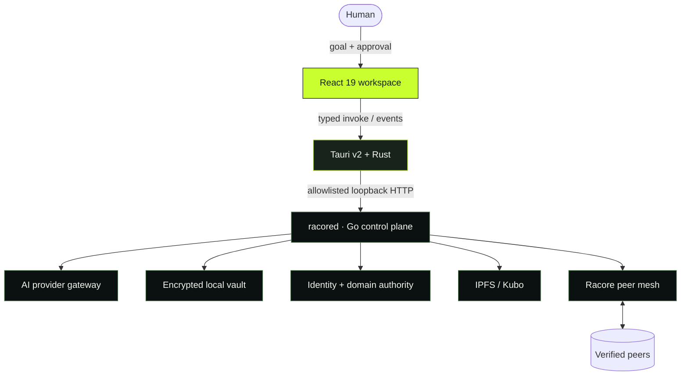

<div align="center">
  

  # The browser built for agency

  **Browse with agents. Publish with proof. Keep control.**

  Racore is a local-first agentic browser and open-web protocol desktop app—built with React, Tauri v2, Rust, and Go.

  [](https://v2.tauri.app/)
  [](https://react.dev/)
  [](https://www.rust-lang.org/)
  [](https://go.dev/)
  [](https://www.typescriptlang.org/)

  [Explore](#why-racore) · [See the app](#inside-racore) · [Architecture](#architecture) · [Quick start](#quick-start) · [Security](#security-by-default)
</div>

<p align="center">
  
</p>



> [!NOTE]
> Racore keeps its control plane on your machine. Agents can research and navigate, but meaningful external side effects stop at a human approval boundary.

## Why Racore

Most AI browsers optimize for automation. Racore optimizes for **agency**: the ability to delegate work without giving up identity, credentials, publishing rights, or the final say.

| | Capability | What it means |
| :--: | --- | --- |
| ✦ | **Agentic workspace** | Research, browse, compare, and execute multi-step workflows from one native desktop surface. |
| ◉ | **Local control plane** | Provider keys, approvals, identity, authority, and peer state stay behind a loopback-only Go service. |
| ✓ | **Human checkpoints** | Actions that affect the outside world require explicit approval before execution. |
| ⬡ | **Verifiable publishing** | Sign releases, address content by hash, and carry proof with the work instead of trusting one platform. |
| ◎ | **Open network** | Discover peers through the Racore mesh and store content through IPFS/Kubo. |
| ⇄ | **Provider freedom** | Connect cloud models, local models, and coding agents through one consistent gateway. |

## Inside Racore

<table>
  <tr>
    <td width="50%">
      
    </td>
    <td width="50%">
      
    </td>
  </tr>
  <tr>
    <td align="center"><b>Discover the system</b><br/><sub>An editorial introduction to the agentic browser and open protocol.</sub></td>
    <td align="center"><b>Choose your boundaries</b><br/><sub>Configure privacy, providers, and network participation before entering.</sub></td>
  </tr>
</table>

<details open>
  <summary><b>The native browser workspace</b></summary>
  <br />
  
</details>

The same React product workspace runs in hosted preview and native desktop modes. A typed adapter selects the correct transport without changing the daemon request schema:

- **Hosted preview** → fixed loopback HTTP to `racored`.
- **Tauri desktop** → typed `invoke()` commands and native events through the Rust backend.

## Architecture



```text
┌─────────────────────────────────────────────────────────────┐
│ React UI                                                    │
│ browser · sites · providers · network · system              │
└──────────────────────────┬──────────────────────────────────┘
                           │ strongly typed commands + events
┌──────────────────────────▼──────────────────────────────────┐
│ Rust / Tauri v2                                             │
│ window lifecycle · capability policy · daemon supervision   │
└──────────────────────────┬──────────────────────────────────┘
                           │ fixed origin · allowlisted routes
┌──────────────────────────▼──────────────────────────────────┐
│ racored / Go                                                │
│ approvals · provider gateway · vault · authority · protocol │
└──────────┬─────────────────────┬───────────────────────┬────┘
           ▼                     ▼                       ▼
       AI models              IPFS/Kubo              peer mesh
```

Read the deeper [architecture guide](docs/architecture.md) and [Tauri migration audit](docs/tauri-migration-audit.md).

## Small native shell, serious control plane

Measured on the same Windows x64 development machine after the Electron → Tauri migration:

| Metric | Electron | Tauri v2 | Improvement |
| --- | ---: | ---: | ---: |
| NSIS installer | 211.9 MB | **49.3 MB** | **76.7% smaller** |
| Application executable | 205.9 MB | **22.4 MB** | **89.1% smaller** |
| Settled process working set | 337.1 MiB | **131.4 MiB** | **61.0% lower** |

These are local smoke-test measurements, not universal benchmarks. See the complete [verification report](docs/tauri-verification.md) for methodology and artifact details.

## Quick start

### Prerequisites

- Node.js **22.13+**
- Rust **1.77.2+** and the [Tauri platform prerequisites](https://v2.tauri.app/start/prerequisites/)
- Go **1.22+**
- A platform-matching [Kubo](https://docs.ipfs.tech/install/command-line/) executable

On Windows, put Kubo at `desktop/runtime/kubo/ipfs.exe` or set `RACORE_KUBO_BINARY`. If Go is not on `PATH`, set `RACORE_GO` to the executable path.

### Run it

```powershell
git clone https://github.com/racore-xyz/racore-browser.git
cd racore-browser
npm install

# Native Tauri application; prepares Go sidecars automatically
npm run desktop:dev
```

For the hosted React preview:

```powershell
npm run dev
```

The desktop application starts or reuses `racored` on `127.0.0.1:47831`. If Racore discovers a daemon it does not own, it will never terminate it.

## Build and verify

```powershell
# React builds + TypeScript/Node contract tests
npm test
npm run lint
npx tsc --noEmit

# Rust safety and command layer
cargo fmt --manifest-path src-tauri/Cargo.toml -- --check
cargo test --manifest-path src-tauri/Cargo.toml
cargo clippy --manifest-path src-tauri/Cargo.toml --all-targets -- -D warnings

# Existing Go daemon and protocol packages
cd god
go test -count=1 ./internal/...
cd ..

# Native installers + runtime artifact inspection
npm run desktop:package
npm run tauri:verify
```

Release bundles are written to `src-tauri/target/release/bundle/`. Verification rejects any shipped Electron runtime, Node.js runtime, `node_modules`, `.node` binding, or `node-gyp` artifact.

## Security by default

Racore uses Tauri v2 capabilities as a deny-by-default boundary:

- The React webview receives no direct filesystem, OS, shell, or opener plugin permissions.
- Frontend requests cross a typed Rust command surface with Serde payloads.
- Daemon proxying is restricted to fixed loopback origins and explicit route/method pairs.
- External URLs are validated before opening in isolated webview windows.
- Responses are size-limited, and long-running daemon work stays off the UI thread.
- Provider credentials are stored in the local encrypted vault.
- CAPTCHAs, access controls, rate limits, and bans are never bypassed.

See [Tauri desktop development](docs/tauri-development.md) for the capability model and release workflow.

## Repository map

```text
racore-browser/
├── app/                    # Shared React product UI
├── desktop-ui/             # Static Vite entry for Tauri
├── src-tauri/              # Rust commands, state, windows, capabilities
├── god/                    # Go daemon, CLI, protocol, and mesh
├── protocol/               # RCP JavaScript tooling
├── scripts/                # Sidecar prep and bundle verification
├── tests/                  # Bridge, scaffold, policy, and bundle tests
├── worker/                 # Cloudflare Worker entry
└── docs/                   # Architecture, migration, and QA records
```

## Principles

1. **Local first** — private state and control live close to the user.
2. **Human in the loop** — delegation never erases consent.
3. **Portable intelligence** — models are providers, not prisons.
4. **Proof over promises** — identity and releases should be independently verifiable.
5. **Open infrastructure** — content and authority should survive a platform.

## Contributing

Issues, design discussions, and focused pull requests are welcome. Start with [CONTRIBUTING.md](CONTRIBUTING.md), keep changes within their architectural layer, and include tests and documentation for behavior changes.

<div align="center">
  <br />
  
  <h3>Browse boldly. Keep control.</h3>
  <sub>Racore Browser · React + Rust + Go · built for the open agentic web</sub>
</div>
